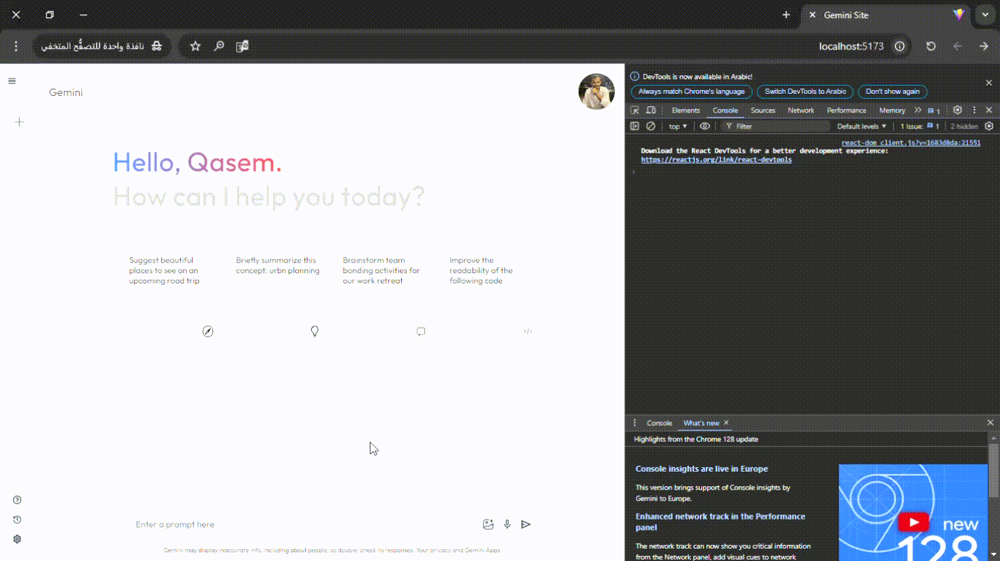

# Gemini-Site 

This project integrates the Gemini-1.5-Flash API to generate AI-based responses and manage application state using React's Context API. The system allows users to interact with the AI model by submitting prompts and receiving generated responses in real-time. The core functionalities include handling user inputs, managing previous prompts, and displaying the AI-generated results.

## Features
- AI-driven response generation using Gemini-1.5-Flash API.
- React Context API for state management.
- Real-time user interaction and result display.

## Setup

To run this project, you need to have an API key for the Gemini-1.5-Flash model. Follow these steps to set up your API key:

1. Get your API key from the Gemini-1.5-Flash service.
2. Open the `/config/gemini.js` file.
3. Replace the placeholder with your actual API key:

```javascript
const apiKey = "YOUR_GEMINI_API_KEY_HERE";
const genAI = new GoogleGenerativeAI(apiKey);

const model = genAI.getGenerativeModel({
  model: "gemini-1.5-flash",
});
```

## Demo

